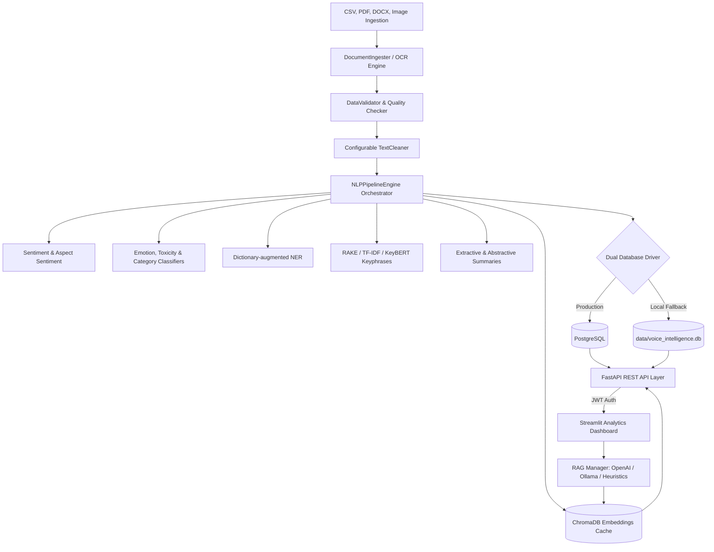

# Production-Grade End-to-End NLP Customer Voice Intelligence Platform

This repository contains a production-grade, highly-configurable **Customer Voice Intelligence Platform** designed to ingest raw multi-format client feedbacks, perform advanced NLP parsing, persist structured semantic outputs, expose a JWT-secured API, and serve an interactive visual analytics dashboard with a built-in Retrieval-Augmented Generation (RAG) assistant.

---

## 🏗️ Platform Architecture



---

## ⚡ Core Platform Capabilities

1. **Multi-Format Ingestion**: Parsers for Excel, CSV, JSON, TXT, PDF, DOCX, and raw images (EasyOCR/Tesseract OCR routing).
2. **Data Integrity Guardian**: Automatically identifies missing values, structural corruptions, non-English inputs, and duplicate reviews (MD5 content hashing).
3. **Advanced Preprocessing Cleaner**: Custom cleaner pipelines (lowercasing, stopword stripping, lemmatization, Porter stemming, and emoji conversions).
4. **Sentiment & Aspect Analysis**: Sentence and clause-level extraction mapping sentiments to specific aspects (UI, battery, pricing, support, features).
5. **Named Entity Recognition (NER)**: Identifies products, locations, organizations, competitors, and technologies using spaCy and dictionary lookups.
6. **Zero-Shot Classifier**: Categorizes reviews into billing complaints, feature requests, bug reports, tech support, etc.
7. **Toxicity & Emotion Detection**: Binary toxicity tracking plus multi-class emotions (Happy, Angry, Frustrated, Disappointed, Neutral, Excited).
8. **Hybrid Semantic Search**: Integrates semantic vector search (all-MiniLM-L6-v2) and lexical BM25 matching using **Reciprocal Rank Fusion (RRF)**.
9. **Citations-Aware RAG Engine**: Generates contextually precise summaries using OpenAI, local Ollama, or a local heuristic compiler, with full citation metadata.
10. **Visual Streamlit Dashboard**: Renders 8 modules (Overview, Sentiment, Aspects, Topics, NER, Search, RAG Chat, MLOps Monitoring).
11. **MLOps and Monitoring**: Automated experiment tracking (MLflow), dataset versioning (DVC files), data quality reporting, and data drift detection.

---

## 🚀 Installation & Local Launch

The platform supports both standalone Python deployment (for offline usage) and multi-container Docker Compose architectures.

### Option A: Running Standalone (Local Python)

1. **Install Dependencies**:
   ```bash
   pip install -r requirements.txt
   ```

2. **Launch Application Launcher**:
   ```bash
   python run.py
   ```
   *This automated script pre-downloads the spaCy and NLTK language packages, runs database schema initialization (local SQLite), and triggers the Streamlit server.*

3. **Access Dashboard**:
   - Streamlit View: `http://localhost:8501`

---

### Option B: Production Deployment (Docker Compose)

Launch the multi-container stack (FastAPI Backend, Streamlit UI, PostgreSQL DB, and MLflow Server) with a single command:

1. **Start Services**:
   ```bash
   docker-compose up --build
   ```

2. **Access Ports**:
   - Streamlit Dashboard: `http://localhost:8501`
   - FastAPI Interactive API: `http://localhost:8000/docs`
   - MLflow Tracking: `http://localhost:5000`

---

## 🛡️ Authentication and Security Roles

The platform enforces JWT access tokens in the FastAPI layer and models authorization roles:
- **`user`**: Basic access to overview and search.
- **`manager`**: Access to analytics and reports generation.
- **`admin`**: Full administrative configurations, retraining hooks, and systems monitoring views.

For local runs, create an account using the **Create Account** tab on the login screen to register credentials in the SQLite/Postgres backend.
